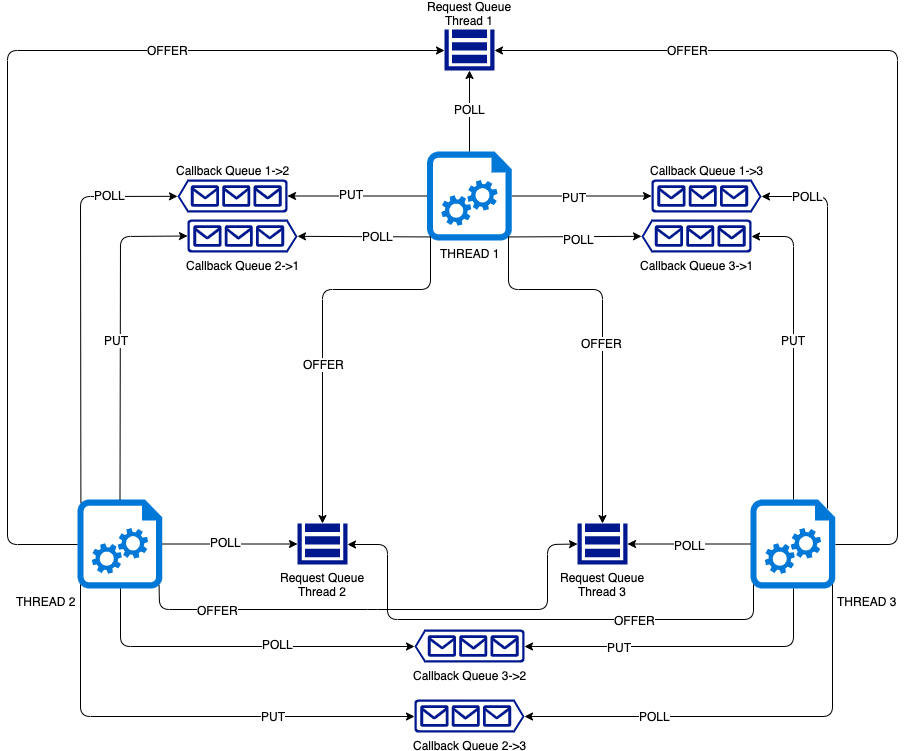

# Lab577 Thread Coding Challenge

## Prerequisites
This project was built with the following elements :
* Java 8
* IntelliJ IDEA CE
* Maven

##The challenge

## Approach
In this solution, each thread has the same algorithm to manage the strategy and 
the communications between the different threads. This solution is based on request/reply
through queues.

Its algorithm is the following :
* 1: Check and process incoming messages
* 2: Send requests for the ball that we own the most to all the threads
* 3: Check responses
* 4: Check if the condition to stop is met
* 5: Back to 1 until stop condition is met

## Architecture

## How-to

## Javadoc
The Javadoc can be found in the ``javadoc`` folder