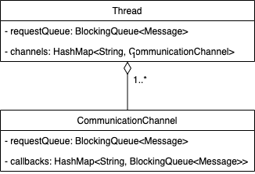

# Lab577 Thread Coding Challenge

## Prerequisites
This project was built with the following elements :
* Java 8
* IntelliJ IDEA CE
* Maven

## The challenge
We have three threads.

In each thread you have array of coloured ‘Balls’, R for Red, B for Blue and G for Green as follows:

* In thread 1: ["R","R","R","G","G","G","B","B","B","R"]

* In Thread 2: ["G","G","G","R","R","B","B","B","R","R"]

* In Thread 3: ["B","B","B","B","R","G","G","G","G","R"]

Build a solution where each thread ends up with an array of balls of a single colour.

The rules are as follows.
* At the beginning of running the solution, no thread can have any knowledge of the balls that the other threads are holding.
* A Single thread can only request or send one ball at a time to another thread.
* When a thread has all the balls of a single colour and no other coloured balls it should exit
## Approach
In this solution, each thread has the same algorithm to manage the strategy and 
the communications between the different threads. This solution is based on request/reply
through queues.

Its algorithm is the following :
* 1: Check and process incoming messages
* 2: Send a request for the ball that we own the most to each threads
* 3: Check responses
* 4: Check if the condition to stop is met
* 5: Back to 1 until stop condition is met


## Architecture
Each thread will have several channels for the communication with the other thread.
Each thread will have one communication channel per thread.
A communication channel is composed of the request queue of the target thread, and
the callbacks queues we have with it.
In solution, each queue has a capacity of only 1.

### Thread communication model
Here is the view of the threads in terms of model* :<br/>
<br/>
*Only the queues and channel are detailed in this model for clarity purposes
### Global communication architecture
Here is the view of the communication architecture:


## Run
To launch the solution, you can either launch the main method in the ````Launcher```` class or run the unit test in 
````LauncherTest```` that will run it several times for you.

## Javadoc
The Javadoc can be found in the ``javadoc`` folder